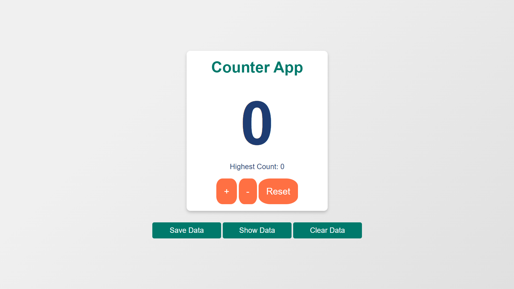

# Modern Counter App

Modern Counter App is a web application that allows users to increment, decrement, reset, and save counter values. It features a modern, responsive design.



## Features

- Increment and decrement the counter
- Reset the counter to zero
- Save the current count with a user name and optional description
- View saved data
- Clear all saved data

## Technologies Used

- HTML
- CSS
- JavaScript

## Getting Started

1. Clone the repository:
    ```bash
    git clone https://github.com/MoSalem149v2/modern-counter-app_DEBI-Task.git
    ```

2. Navigate to the project directory:
    ```bash
    cd modern-counter-app
    ```

3. Open the `index.html` file in your web browser:
    ```bash
    open index.html
    ```

## Topics

- Web Development
- Front-end
- Counter Application
- Local Storage
- HTML
- CSS
- JavaScript
- Responsive Design

## Contributing

Contributions are welcome! Please fork the repository and submit a pull request.
